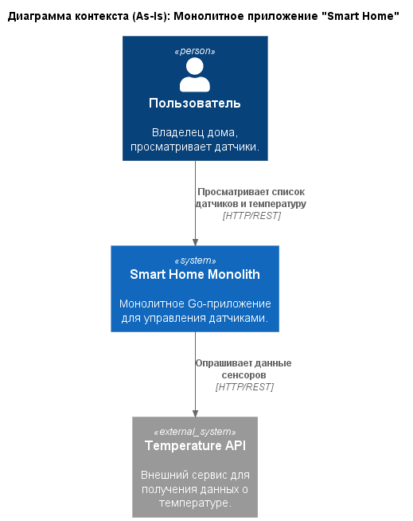
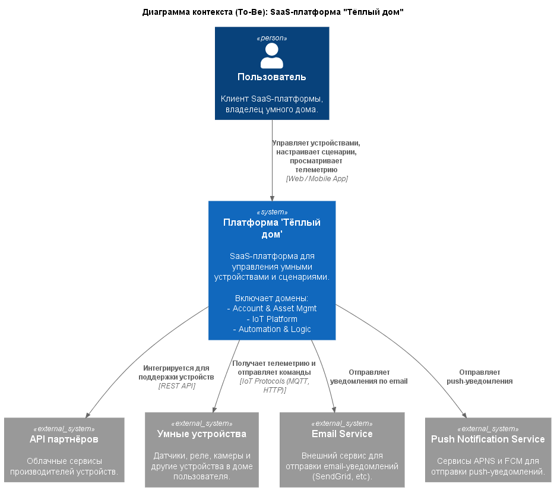
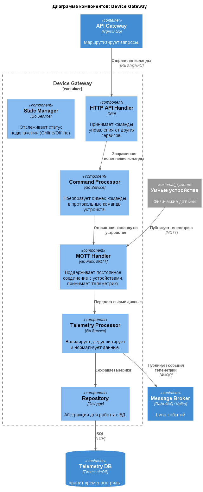
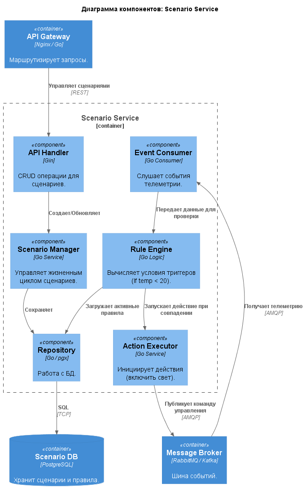
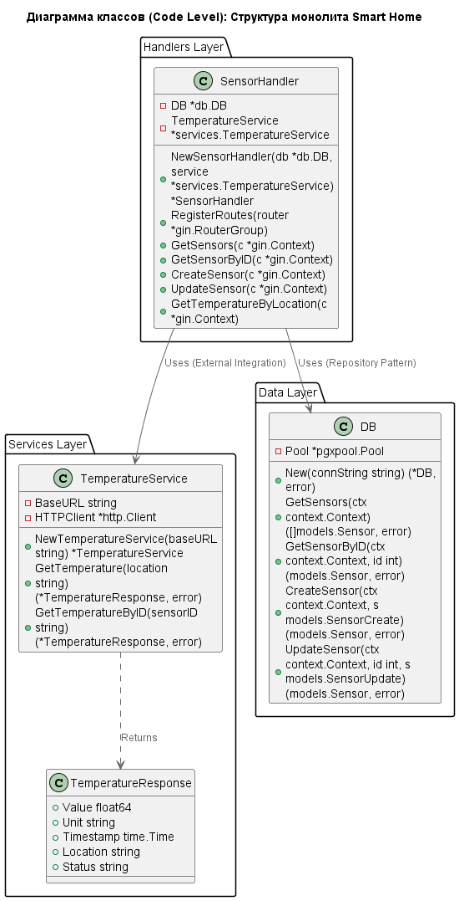
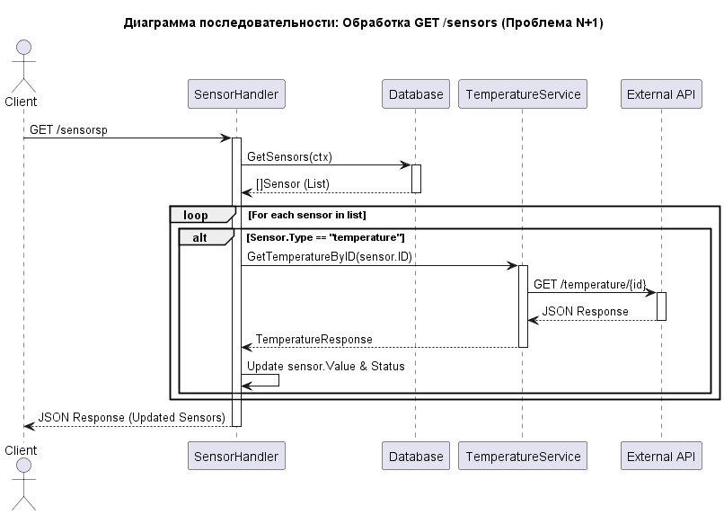
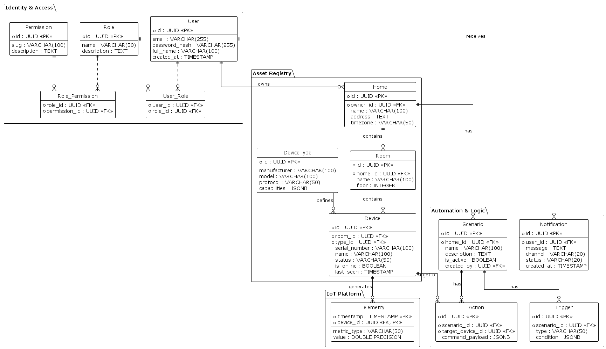

# Project_template

Это шаблон для решения проектной работы. Структура этого файла повторяет структуру заданий. Заполняйте его по мере работы над решением.

# Задание 1. Анализ и планирование

<aside>

Чтобы составить документ с описанием текущей архитектуры приложения, можно часть информации взять из описания компании и условия задания. Это нормально.

</aside

### 1. Описание функциональности монолитного приложения

**Управление датчиками (Sensor Management):**
- Пользователи могут просматривать список всех заведенных в системе датчиков, получать информацию по конкретному датчику по его ID, вручную обновлять значения и статусы датчиков (например, перевод в статус active или inactive) через API
- Система поддерживает редактирование метаданных существующих датчиков и их удаление из базы данных.

**Мониторинг температуры:**

- Пользователи могут запрашивать текущую температуру для конкретной локации (комнаты) через специальный API-эндпоинт (/sensors/temperature/:location).
- Система поддерживает интеграцию с внешним сервисом (temperature-api) для получения данных в реальном времени. При запросе информации о датчиках типа temperature, приложение автоматически опрашивает внешний источник для актуализации значени

### 2. Анализ архитектуры монолитного приложения

#### Технологический стек
- **Язык программирования:** Go
- **База данных:** PostgreSQL (версия 16-alpine)
- **Инфраструктура:** Docker, Docker Compose

#### Архитектурный стиль
- **Тип:** Монолитное приложение (Monolith).
- **Взаимодействие:** Синхронное (REST HTTP). Приложение напрямую обращается к `temperature-api` по HTTP.

#### Конфигурация и Среда
- **Управление конфигурацией:** Через переменные окружения (соблюдение принципов 12-Factor App).
- **Сетевое взаимодействие:** Сервисы изолированы в сети `smarthome-network`.

#### Ограничения (Technical Debt)
- **Масштабируемость:** Только вертикальная или полное дублирование инстансов.
- **Отказоустойчивость:** Высокая связность (Coupling) с `temperature-api`.
- **Развертывание:** Требует остановки сервиса (Downtime deployment) при обновлении контейнера.е.

### 3. Определение доменов и границы контекстов

#### Домен 1: Управление Аккаунтами и Активами (Account & Asset Management)
Отвечает за то, **кто** является пользователем системы и **чем** он владеет.

*   **Поддомен: Реестр Активов (Asset Registry)**
    *   **Ключевые функции:** Управление иерархией объектов (Дом → Комната), инвентаризация устройств и их привязка к комнатам, управление метаданными устройств (название, модель, поддерживаемые команды). Является единым источником правды (Source of Truth) об активах пользователя.
    *   **Ключевые сущности:** `Account`, `Home`, `Room`, `Device`.

*   **Поддомен: Управление Пользователями и Доступом (Identity & Access Management)**
    *   **Ключевые функции:** Регистрация и аутентификация пользователей, управление профилями, правами доступа и ролями (например, "владелец", "член семьи", "гость"). Основа для модели SaaS и самообслуживания.
    *   **Ключевые сущности:** `User`, `Role`, `Permission`, `Credential`.

#### Домен 2: Платформа IoT (IoT Platform)
Отвечает за **взаимодействие с физическим миром** — приём данных и отправку команд на устройства.

*   **Поддомен: Шлюз Устройств (Device Gateway)**
    *   **Ключевые функции:** Обеспечение двунаправленной связи с устройствами по разным протоколам (MQTT, HTTP Webhooks). Принимает телеметрию, отправляет команды, управляет статусом подключения устройств (online/offline).
    *   **Ключевые сущности:** `Connection`, `Message`, `Topic`, `CommandPayload`.

#### Домен 3: Автоматизация и Логика (Automation & Logic)
Отвечает за **"интеллект"** системы и реализацию пользовательских сценариев.

*   **Поддомен: Движок Сценариев (Scenario Engine)**
    *   **Ключевые функции:** Позволяет пользователям "программировать" систему. Обрабатывает и выполняет пользовательские правила (например, "Если температура < 20°C, включить отопление"). Реализует ключевое требование к гибкости и самообслуживанию.
    *   **Ключевые сущности:** `Scenario`, `Rule`, `Trigger`, `Action`.

*   **Поддомен: Управление Уведомлениями (Notification Service)**
    *   **Ключевые функции:** Отправка пользователям push-уведомлений, email или SMS о важных событиях (например, "Датчик дыма сработал!", "Ворота открыты").
    *   **Ключевые сущности:** `Notification`, `Channel` (push/email), `Template`.

#### Карта Контекстов (Context Map)

| Домен | Поддомен  | Роль |
| :--- | :--- | :--- | :--- |
| **Account & Asset Mgmt** | **Identity & Access** | Управляет доступом пользователей (SaaS). |
| **Account & Asset Mgmt** | **Asset Registry** | Инвентаризация домов и устройств. |
| **IoT Platform** | **Device Gateway** | Связь с физическим миром. |
| **Automation & Logic** | **Scenario Engine** | Реализует "умные" сценарии пользователя. |
| **Automation & Logic** | **Notification Service** | Информирует пользователя о событиях. |


### **4. Проблемы монолитного решения**
С учётом планов по созданию гибкой SaaS-платформы, текущее монолитное решение создаёт следующие критические проблемы:

- **Сильная связанность доменов (High Domain Coupling):** Код для управления пользователями (`Identity & Access`), логики сценариев (`Scenario Engine`) и взаимодействия с устройствами (`Device Gateway`) тесно переплетён. Ошибка в коде `Device Gateway` может остановить работу критичных для SaaS-модели поддоменов, например, аутентификацию пользователей или выполнение сценариев.
- **Неэффективное масштабирование (Inefficient Scaling):** Для обработки пиковой нагрузки от тысяч устройств (поддомен `Device Gateway`) придётся масштабировать всё приложение целиком, включая редко используемые части, как `Asset Registry`. Это приводит к нерациональному использованию ресурсов и росту затрат на инфраструктуру.
- **Замедление разработки (Slow Development Velocity):** В конкурентной SaaS-среде скорость вывода новых функций (Time-to-Market) критична. В монолите добавление поддержки нового типа устройств или нового действия в `Scenario Engine` требует полного регрессионного тестирования и развертывания всей системы, что медленно и рискованно.
- **Технологические ограничения (Technological Constraints):** Монолит вынуждает использовать единый технологический стек для всех задач. В то время как PostgreSQL отлично подходит для `Asset Registry`, для `Device Gateway` может быть эффективнее использовать брокер сообщений (например, RabbitMQ/Kafka), а для `Scenario Engine` — специализированный движок правил или serverless-функции.
- **Отсутствие изоляции ресурсов (Lack of Resource Isolation):** В многопользовательской SaaS-системе один "шумный сосед" (например, пользователь, создавший ресурсоёмкий сценарий в `Scenario Engine`) может замедлить или нарушить работу всей платформы для всех остальных клиентов. Монолит не обеспечивает должной изоляции.

### 5. Визуализация контекста системы — диаграмма С4




# Задание 2. Проектирование микросервисной архитектуры

В этом задании вам нужно предоставить только диаграммы в модели C4. Мы не просим вас отдельно описывать получившиеся микросервисы и то, как вы определили взаимодействия между компонентами To-Be системы. Если вы правильно подготовите диаграммы C4, они и так это покажут.

**Диаграмма контейнеров (Containers)**


**Диаграмма компонентов (Components)**




**Диаграмма кода (Code)**




# Задание 3. Разработка ER-диаграммы



# Задание 4. Создание и документирование API

### 1. Тип API
Для архитектуры "Тёплый дом" выбран гибридный подход:
1.  **REST API (Synchronous):** Используется для взаимодействия Frontend -> Backend и межсервисных запросов, требующих немедленного ответа (например, `Asset Service` для получения конфигурации или `Identity Service` для проверки токена). Это стандарт де-факто, простой в отладке и интеграции.
2.  **AsyncAPI (Asynchronous/Event-Driven):** Используется для передачи потока телеметрии от `Device Gateway` к `Scenario Service` и `Notification Service`. Это позволяет избежать блокировок при высокой нагрузке от датчиков и обеспечивает слабую связность (Decoupling) компонентов.

### 2. Документация API

Ниже представлены контракты взаимодействия микросервисов:
*   **REST API Contract (OpenAPI 3.0)** — Описывает эндпоинты для регистрации устройств, управления ими и создания сценариев.
*   **Event Bus Contract (AsyncAPI)** — Описывает структуру событий телеметрии и команд, передаваемых через Message Broker.

# Задание 5. Работа с docker и docker-compose

Перейдите в apps. 
Там находится приложение-монолит для работы с датчиками температуры. В README.md описано как запустить решение.

Вам нужно:
1) сделать простое приложение temperature-api на любом удобном для вас языке программирования, которое при запросе /temperature?location= будет отдавать рандомное значение температуры.

Locations - название комнаты, sensorId - идентификатор названия комнаты

```
	// If no location is provided, use a default based on sensor ID
	if location == "" {
		switch sensorID {
		case "1":
			location = "Living Room"
		case "2":
			location = "Bedroom"
		case "3":
			location = "Kitchen"
		default:
			location = "Unknown"
		}
	}

	// If no sensor ID is provided, generate one based on location
	if sensorID == "" {
		switch location {
		case "Living Room":
			sensorID = "1"
		case "Bedroom":
			sensorID = "2"
		case "Kitchen":
			sensorID = "3"
		default:
			sensorID = "0"
		}
	}
```

2) Приложение следует упаковать в Docker и добавить в docker-compose. Порт по умолчанию должен быть 8081

3) Кроме того для smart_home приложения требуется база данных - добавьте в docker-compose файл настройки для запуска postgres с указанием скрипта инициализации ./smart_home/init.sql

Для проверки можно использовать Postman коллекцию smarthome-api.postman_collection.json и вызвать:

- Create Sensor
- Get All Sensors

Должно при каждом вызове отображаться разное значение температуры

Ревьюер будет проверять точно так же.
